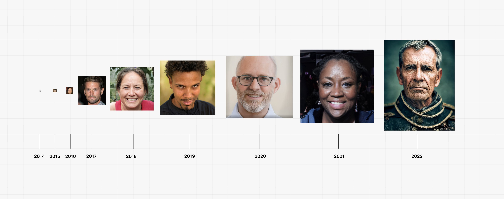
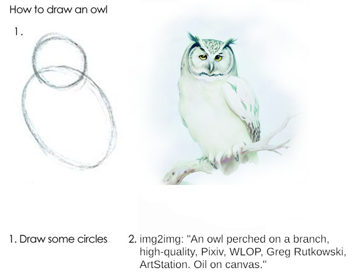

# Awesome AI image synthesis     

> A list of awesome tools, ideas, prompt engineering tools, colabs, models, and helpers for the prompt designer playing with aiArt and image synthesis. Covers Dalle2, MidJourney, StableDiffusion, and open source tools. Many of these tools come with "batteries included" and won't include colabs or python code you have to run. (for colabs see [this list](https://pharmapsychotic.com/tools.html))

## Contents

- [🤖 Text-to-image Models](#text-to-image-models-you-can-run)
  - [💰 Commercial](#commercial) 
  - [☁️ Free hosted](#free-hosted-tools)
  - [💻 Free local](#free-local)  - Run on your GPU
- [✍️ Prompt engineering](#prompt-engineering)
    - [🎨 Tools for prompt engineer](#tools-for-prompt-engineers)
    - [📚 Artist studies](#artistmodifier-studies)
    - [🔗 Browser extensions](#browser-extensions)
    - [🎩 Tips and tricks](#tips-and-tricks)
    - [🎭 Inspiration tools](#inspiration-tools)
- [✨ Post processing tools](#post-processing-tools)
    - [💰 Resolution upscale - hosted](#resolution-upscale---subscription)
    - [🆓 Resolution upscale - free](#resolution-upscale---free)
    - [🙃 Fix faces](#fix-faces)
    - [✋ Fix hands](#fix-hands)
    - [👸 Beutify](#Beutify)
    - [👩‍🌾 Outcrop](#Outcrop)
    - [👩‍🎨 Inpaint ](#Inpaint)
- [👨‍👨‍👧‍👦 Communities](#communities)
    - [👾 Discord](#discord)
    - [👽 Reddit](#reddit)
- [👩‍🏫 Theory & Learning](#theory--learning) 
    - [📖 Tutorials](#tutorials)
    - [🐦 Twitter Threads](#twitter-threads)
    - [🎥 Videos](#youtube-video-resources) 
    - [✉️ Substack newsletters](#substack-newsletters)
    - [🫡  Notable twitter follows](#notable-twitter-follows)
- [🚨 Upcoming exciting projects](#upcoming-exciting-projects] 

## Text-to-image Models you can run

Models, commercial and open source, that you can either try for free and pay for credits or can run in the cloud. 

### Commercial 

- [DreamStudio](https://beta.dreamstudio.ai/) - #StableDiffusion in the cloud 
- [Midjourney](https://www.midjourney.com/app/) - Discord bot with amazing visuals
- [Dalle2](https://labs.openai.com/) - The one that started it all, great with multi characters
- [NightCafe](https://creator.nightcafe.studio/) - Nightcafe studio is an AI Art Generator (incrorporates stableDiffusion)
- [ArtBreeder Collage](https://collage.artbreeder.com/) - A collaging tool to generate art using visual aides.
- [Photoroom](https://www.photoroom.com/backgrounds/) - Photoroom has a new feature for backgrounds (featured on product hunt)

### Free hosted tools

- [Craiyon](https://www.craiyon.com/) - Formerly dalleMini - open source tool that outputs great compositions but lower quality
- [StableDiffusion on HuggingFace](https://huggingface.co/spaces/stabilityai/stable-diffusion) - Run the #StableDiffusion right in huggingface UI 
- [StableDiffusion on Replicate](https://replicate.com/stability-ai/stable-diffusion) - Run #StableDiffusionon on replicate.com 
- [Google Colab](https://colab.research.google.com/) - Google free GPU machines in the cloud running models of all sorts.

### Free local  
> *Advanced Batteries not included, this section is for advanced folks who can use the command line, install python packages, run code etc' 
- [StableDiffusion + Web GUI](https://github.com/hlky/stable-diffusion-webui) - This repo has a step by step way to install and run #stableDiffusion using local GPU + a gradio based web UI. Has a nice UI, upscalers built-in, img2img and inpainting, and a LOT more! (see [thread](https://twitter.com/altryne/status/1563452692399214594) with features

- [StableDiffusion with Diffusers](https://huggingface.co/blog/stable_diffusion) - A simple-ish way to run stable diffusion locally using hugging face diffusers library

### img2img - Generate images from a combination of prompt + init image

> img2img refers to the practice of feeding a model an init image AND a prompt. 
- [stable-img-to-img](https://replicate.com/afiaka87/stable-image-to-image) - Hosted version of img2img tool from stable diffusion. Provide an image + a prompt
- [Diffuse-The-Rest](https://huggingface.co/spaces/huggingface/diffuse-the-rest) - A simple Hugging Face img2img tool that allows for image upload and/or simplistic drawing with a prompt

## Prompt engineering
> The emerging field of the Prompt Engineering is just beginning, and yet there are tools released for us every day. Follow this repo for the best tools as they become "Awesome"
### Tools for prompt engineers
  - [Lexica](https://lexica.art/) - A Stable Diffusion prompts search engine
  - [Libraire](https://libraire.ai/) - Another Stable Diffusion prompts search engine, with over 10M images and prompts
  - [Krea.ai](https://www.krea.ai/) - A prompt builder with a nice UI, searchable prompts.
  - [PromptMania prompt builder](https://promptomania.com/prompt-builder/) - A prompt builder that supports MJ, SD and Dalle, with visual examples and a lot of modifiers
  - [Promptbase Marketplace](https://promptbase.com/) - Buy and sell your promtps for 💰
  - [GPT-2 prompt generator](https://huggingface.co/succinctly/text2image-prompt-generator) - A GPT2 model trained to autocomplete MJ prompts

### Artist/Modifier studies 
  - [Stable diffusion artist study](https://proximacentaurib.notion.site/e2537cbf42c34b7e9a9a4126f81dfd0d?v=7b4a3c03fb654045be324eb71acc57e6) - A huge list of artist (no living) with examples by ([@sureailabs](https://twitter.com/sureailabs), [@proximasan](https://twitter.com/proximasan), [@EErratica](https://twitter.com/EErratica), and [@KyrickYoung](https://twitter.com/KyrickYoung))
  - [StableDiffusion modifier study](https://proximacentaurib.notion.site/2b07d3195d5948c6a7e5836f9d535592?v=b5b75a67cc52483c9965cfc141f6f582) - A great study of modifiers that can enhance your prompts significantly
  - [Google doc with 3800+ artists and styles](https://docs.google.com/document/u/0/d/1SaQx1uJ9LBRS7c6OsZIaeanJGkUdsUBjk9X4dC59BaA) - Great collaborative effort 3800+ artists and styles + tips for prompting. Continuesly updated. (without generated images) 

### Browser extensions 
  - [Dalle prompt helper](https://github.com/altryne/dalle-prompt-extension) - a chrome extension to inject prompts into the Dalle interface by [@altryne](https://twitter.com/altryne)

### Tips and tricks 
  - [CLIP interrogator](https://github.com/pharmapsychotic/clip-interrogator) - Convert uploaded images into prompts by [@pharampsychotic](https://twitter.com/pharmapsychotic) 
  - [img2prompt](https://replicate.com/methexis-inc/img2prompt) - Hosted version of CLIP interrogator on Replicate. Upload image, get prompt ideas. 
### Inspiration tools 
  - [same.energy](https://same.energy) - A visual exploration search engine. 
  - [CLIP retrieval](https://rom1504.github.io/clip-retrieval/?back=https%3A%2F%2Fknn5.laion.ai&index=laion5B&useMclip=false) - Allows you to browse the major datasets the img-2-text models were trained on. 

## Post processing tools
### Resolution upscale - subscription
- [Gigapixel upscaler](https://www.topazlabs.com/gigapixel-ai) Great upscaler app + web. One time payment
- [https://letsenhance.io/](https://letsenhance.io/) - LetEnhance is a credit based enhancement system

### Resolution upscale - free
  - [WebUI repo](#free-local) has upscalers built in!
  - [real-esrgan](https://replicate.com/nightmareai/real-esrgan) - A hosted version of real-ERSGan with optional face correction
  - [Cupscale](https://github.com/n00mkrad/cupscale) - Windows app that upscales with ERSGan on your GPU
  - [chaiNNer](https://github.com/joeyballentine/chaiNNer) - A flowchart/node-based image processing GUI for Windows, MacOS, and Linux

### Fix faces
- 
### Fix hands
-  
### Beutify
- TBD
### Outcrop
 - TBD
### Inpaint 
- TBD

## Communities 
### Discord
  - [Stable Diffusion discord](https://discord.gg/stablediffusion) - A great community with folks who help each other
  - [MidJourney](https://discord.com/invite/midjourney) - A huge community of image synthesis folks, prompt help, inspiration channels, etc

### Reddit
  - [r/StableDiffusion](https://www.reddit.com/r/StableDiffusion/) - A rapidly growing Subreddit for Stable Diffusion related content - Community Run
  - [r/MidJourney](https://www.reddit.com/r/midjourney/) - The official subreddit for MidJourney related Content

## Theory & Learning 
### Tutorials
  - [How to get images that don't suck](https://www.reddit.com/r/StableDiffusion/comments/x41n87/how_to_get_images_that_dont_suck_a/?utm_source=share&utm_medium=web2x&context=3) - A Beginner/Intermediate Guide to Getting Cool Images from Stable Diffusion, by [u/pxan](https://www.reddit.com/user/pxan/) on Reddit
  - [A-Traveler-s-Guide-to-the-Latent-Space](https://sweet-hall-e72.notion.site/A-Traveler-s-Guide-to-the-Latent-Space-85efba7e5e6a40e5bd3cae980f30235f#68987404382d4807b57204429d50e53d) - In depth guide for prompt engineering. 
  - [Dalle2 prompt book](https://dallery.gallery/the-dalle-2-prompt-book/) - A great, visual intro to prompt creation by [@guyp](https://twitter.com/guyp) - Dalle focused

### YouTube Video Resources
  - [bycloud](https://www.youtube.com/c/bycloudAI) - A channel focused on AI related content, with a lot of content foscusing on AI-Generated artwork.
    - [Is Stable Diffusion Actually Better Than DALL-E 2?](https://youtu.be/5VpucfQl3q0) - A video from [bycloud](https://www.youtube.com/c/bycloudAI) comparing Stable Diffusion to DALL-E 2.
    - [The Current State of AI Generated Art](https://youtu.be/aqW-8WtYJvw) Another video from [bycloud](https://www.youtube.com/c/bycloudAI) showing the history and current world of AI Generated art (Released just before Stable Diffusion was truly a thing, talks about it generally with Latent Diffusion though).
  - [MattVidPro AI](https://www.youtube.com/c/MattVideoProductions202) - A channel mostly focused on AI related content, including MidJourney, DALL-E 2, and Stable Diffusion.
    -[Text to Image AI Backlash - Should AI be regulated?](https://youtu.be/Qt60fmSYZsA) - A video by [MattVidPro AI](https://www.youtube.com/c/MattVideoProductions202) covering backlash to the release of Stable Diffusion and addressing the arguments about if AI should be regulated by law. Includes part of an interview with Emad Mostaque, the creator of Stability.
  - [Scott Detweiler](https://www.youtube.com/c/ScottDetweiler/featured) - A great channel featuring videos covering MidJourney and Stable Diffusion content

### Twitter Threads
- [Dalle vs MJ vs StableDiffusion](https://twitter.com/fabianstelzer/status/1561019187451011074) - A great thread comparing the 3 main models by [@fabianstelzer](https://twitter.com/fabianstelzer)
- [Stable Diffusion explained](https://twitter.com/ai__pub/status/1561362542487695360) - A easy to udnerstand stable diffusion explanation thread by [@ai__pub](https://twitter.com/ai__pub)

#### Notable Twitter Accounts
- [Ai, AiArt, Generative](https://twitter.com/i/lists/1318967584721690626?show=top) - A twitter list of 70+ #aiArt community members, a stream of conciuosness for the field 
- [@ClaireSilver12](https://twitter.com/ClaireSilver12) - Great content, tips and tricks, up to date knowledge about ai synthesis
- [@TomLikesRobots](https://twitter.com/TomLikesRobots) - Deep insight into this new tech, with updates
- 
- [@diffusionBot](https://twitter.com/diffusionbot) - A stableDiffusion bot that generates a prompt right in twitter replies when you mention it. 
- [Whats AI - Louis Bouchard](https://twitter.com/Whats_AI) - Accessible AI concepts, paper reviews, youtube videos 

## Upcoming exciting projects
> 🚨 These are some of amazing things folks are working on, and is worth keeping in mind, maybe register to their waiting list or give them a follow
- [Alpaca - Photoshop plugin](https://www.getalpaca.io/) - Exciting photoshop implementation! [DEMO](https://t.co/YvTEJeuJ8N)
- [Stable Diffusion for Krita](https://www.reddit.com/r/StableDiffusion/comments/x4wtt0/outpainting_with_my_krita_plugin_for_stable/) - Soon to be releasing plugin to allow Stable Diffusion features within the Krita art program
- [Ando - figma plugin](https://twitter.com/RemitNotPaucity/status/1562319004563173376) - Figma plugin! [DEMO](https://twitter.com/RemitNotPaucity/status/1562319004563173376)
- [Stablender - a blender plugin](https://github.com/shellward/StablenderDiffusion) - a WIP blender plugin with SD
- 
## If you find this list valuable

## Contribute

Contributions more than welcome!
In fact it's why I wrote this list, to get contributions and have folks subscribe to changes to get notified about new and exciting stuff coming to this world of AI art

 Read the [contribution guidelines](contributing.md) first.

## Acknowledgements and shoutouts   

[@pharampsychotic](https://twitter.com/pharmapsychotic) - For the insane [tools list](https://pharmapsychotic.com/tools.html) on their website, the support in DMs, and the spaces with a lot of patience and answers ❤️ 
